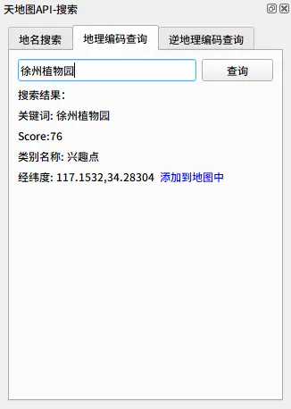

# TianDiTu Tools

QGIS 天地图工具，方便进行天地图瓦片底图的添加以及简单实现了部分[天地图 Web 服务 API](http://lbs.tianditu.gov.cn/server/guide.html)（地名搜索、地理编码查询、逆地理编码查询）

## 使用说明

安装插件后，可在 QGIS 工具栏中看到工具按钮，按钮功能分别为添加底图、搜索、以及设置

### 设置天地图 Key

使用前需要设置天地图 Key，点击设置按钮，输入 key，保存并检查

> 天地图 key 需要到[ 天地图控制台 ](https://console.tianditu.gov.cn/api/key)去申请，申请的类型为“浏览器端”

### 天地图底图添加

在工具栏下拉菜单中选择底图，点击即可添加到当前工程中。

### 天地图 Web 服务 API

|            地名搜索            |                地理编码                |                 逆地理编码                 |
| :----------------------------: | :------------------------------------: | :----------------------------------------: |
|  |  |  |

双击结果项(或点击链接)可添加至当前地图中：

