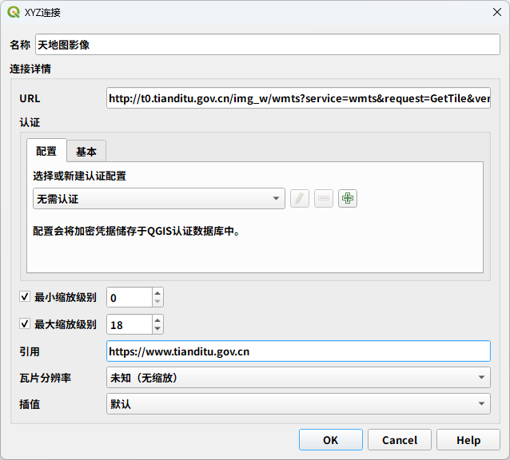

# 通过 XYZ Tiles 添加天地图

天地图的 XYZ 链接为:

`http://t0.tianditu.gov.cn/img_w/wmts?service=wmts&request=GetTile&version=1.0.0&LAYER=img&tileMatrixSet=w&TileMatrix={z}&TileRow={y}&TileCol={x}&style=default&format=tiles&tk=<自己申请的key>`

以往, 直接填入这一串 URL 就可以正常访问天地图了. 但不知从什么时候开始,加载底图就不行了,原因天地图是启用了防盗链, 需要验证 Referer 后才能正常返回瓦片, 否则就是返回疑似攻击.

所以, 在填天地图 XYZ Tiles 的时候, 需要将 Referer 栏（被翻译成“引用”）填入天地图的官网 `https://www.tianditu.gov.cn` 即可正常加载天地图.

---

参考资料:

1. [通过QGIS XYZ Tiles访问国内四大图商地图服务](https://mp.weixin.qq.com/s/V4yI1yqzGSR1M8oqEn0wbA)
2. [QGIS文章一 —— 实现天地图加载](https://mp.weixin.qq.com/s/6ZUnTNYftIkPDGpV7UxXgA)
